# HanaAgent (OpenHanako) 代码结构

```mermaid
flowchart TD
    subgraph DESKTOP["🖥️ Desktop — Electron 42"]
        direction TB
        MAIN["main.cjs\n(Electron Main Process)"]
        PRELOAD["preload.cjs\n(Context Bridge)"]
        BOOTSTRAP_CJS["bootstrap.cjs\n(Server Lifecycle)"]
        IPC["ipc-wrapper.cjs\n(IPC 封装)"]
        KEEP_AWAKE["keep-awake.cjs"]
        AUTO_UPDATER["auto-updater.cjs"]
        FILE_WATCH["file-watch-*.cjs\n(文件变更监听)"]
        WORKSPACE_WATCH["workspace-watch-registry.cjs"]
        LOGIN_ITEM["login-item-settings.cjs"]
        NATIVE["native/\n(C++ Addon)"]
        FILE_TEXT_IO["file-text-io.cjs"]

        MAIN --> PRELOAD
        MAIN --> BOOTSTRAP_CJS
        MAIN --> IPC
        MAIN --> FILE_WATCH
        MAIN --> WORKSPACE_WATCH
        MAIN --> NATIVE
        MAIN --> FILE_TEXT_IO
    end

    subgraph RENDERER["🎨 Renderer — React 19 + Zustand 5"]
        direction TB
        APP["App.tsx"]
        MAIN_CONTENT["MainContent.tsx"]
        APP_INIT["app-init.ts"]
        BOOTSTRAP_TSX["bootstrap.ts"]

        subgraph PAGES["Pages / Windows"]
            MAIN_WIN["main.tsx\n(主窗口)"]
            ONBOARDING["onboarding-main.tsx\n(引导向导)"]
            SETTINGS["settings-main.tsx\n(设置页)"]
            MOBILE["mobile-main.tsx\n(Mobile PWA)"]
            QUICK_CHAT["quick-chat-main.tsx\n(快捷对话)"]
            BROWSER_VIEWER["browser-viewer-main.tsx\n(浏览器查看器)"]
            VIEWER_WINDOW["viewer-window-entry.tsx\n(全屏媒体查看器)"]
            SPLASH["splash-main.tsx\n(启动屏)"]
        end

        subgraph COMPONENTS["react/components"]
            CHAT["聊天组件"]
            SIDEBAR["侧栏"]
            DESK_UI["书桌 UI"]
            SKILL_MGR["技能管理"]
            AGENT_CARD["Agent 卡片"]
            CHANNEL_UI["频道面板"]
            PLUGIN_UI_COMP["插件卡片"]
        end

        subgraph STORES["react/stores (Zustand)"]
            CHAT_STORE["chat-store"]
            AGENT_STORE["agent-store"]
            SETTINGS_STORE["settings-store"]
            DESK_STORE["desk-store"]
            PLUGIN_STORE["plugin-store"]
            CHANNEL_STORE["channel-store"]
        end

        subgraph SERVICES["react/services"]
            WS_CLIENT["ws-client\n(WebSocket)"]
            API["api-client\n(REST)"]
            FILE_SVC["file-service"]
            MEDIA_SVC["media-service"]
        end

        subgraph UI_KIT["react/ui (组件库)"]
            UI_PRIMITIVES["基础组件"]
            FORMS["表单组件"]
            LAYOUT["布局组件"]
            MODALS["弹窗组件"]
        end

        subgraph EDITOR["react/editor"]
            MD_EDITOR["Markdown 编辑器"]
            PROMPT_INPUT["输入框"]
        end

        subgraph HOOKS["react/hooks"]
            USE_WS["useWebSocket"]
            USE_CHAT["useChat"]
            USE_DESK["useDesk"]
            USE_MEDIA["useMedia"]
        end

        APP --> PAGES
        APP --> COMPONENTS
        APP --> STORES
        APP --> SERVICES
    end

    subgraph SERVER["⚙️ Server — Hono + @hono/node-server"]
        direction TB
        SERVER_IDX["index.ts\n(Server Entry)"]
        BOOTSTRAP_SRV["bootstrap.ts\n(启动编排)"]
        CLI["cli.ts\n(Server-First CLI)"]
        WS_PROTO["ws-protocol.ts\n(WebSocket 协议)"]
        WS_SCOPE["ws-scope.ts"]
        SESSION_STREAM["session-stream-store.ts"]
        TASK_BUS["task-bus-handlers.ts"]
        BLOCK_EXTRACT["block-extractors.ts"]
        SUGGESTION["suggestion-blocks.ts"]
        APP_EVENTS["app-events.ts"]
        HONO_HELPERS["hono-helpers.ts"]
        DEFERRED["deferred-result-interlude.ts"]

        subgraph ROUTES["server/routes"]
            API_ROUTES["REST API 路由"]
            BRIDGE_ROUTES["Bridge 平台路由"]
            MEDIA_ROUTES["媒体路由"]
            PLUGIN_ROUTES["插件路由"]
            MOBILE_ROUTES["Mobile PWA 路由"]
        end

        subgraph HTTP_LAYER["server/http"]
            HTTP_CORE["HTTP 核心"]
        end

        subgraph SERVER_UTILS["server/utils"]
            SRV_UTILS["服务端工具函数"]
        end

        SERVER_IDX --> ROUTES
        SERVER_IDX --> WS_PROTO
        SERVER_IDX --> SESSION_STREAM
        SERVER_IDX --> TASK_BUS
    end

    subgraph CORE["🧠 Core — 引擎编排层"]
        direction TB
        ENGINE["engine.ts\n(核心 Facade)"]
        AGENT_MGR["agent-manager.ts"]
        AGENT["agent.ts\n(Agent 实例)"]
        MODEL_MGR["model-manager.ts"]
        SESSION_MGR["session-manager.ts"]
        CHANNEL_MGR["channel-manager.ts"]
        BRIDGE_SESSION["bridge-session-manager.ts"]
        SKILL_MGR_CORE["skill-manager.ts"]
        PLUGIN_MGR["plugin-manager.ts"]
        PREF_MGR["preferences-manager.ts"]
        LLM_CLIENT["llm-client.ts"]
        LLM_UTILS["llm-utils.ts"]
        CONFIG_COORD["config-coordinator.ts"]
        EXEC_BOUNDARY["execution-boundary.ts\n(安全边界)"]
        EXEC_ROUTER["execution-router.ts"]
        EXEC_LEASE["execution-lease-*.ts\n(执行租约)"]
        CAPABILITY["capability-policy.ts"]
        GRANT_REG["grant-registry.ts"]
        EVENTS["events.ts\n(事件类型)"]
        COMPACTION["compaction-utils.ts"]
        MIGRATIONS["migrations.ts\n(DB 迁移)"]
        MODEL_SYNC["model-sync.ts"]
        MSG_SANITIZER["message-sanitizer.ts"]
        MSG_UTILS["message-utils.ts"]
        FIRST_RUN["first-run.ts"]
        FRESH_IMPORT["fresh-import.ts"]
        LOCAL_ACCOUNT["local-user-account.ts"]
        DEVICE_REG["device-registry.ts"]
        MEDIA_ADAPTER_REG["media-adapter-registry.ts"]
        MEDIA_PROTO["media-protocols.ts"]
        MEDIA_RUNTIME["media-runtime-contract.ts"]

        subgraph CORE_SUB["core 子模块"]
            COMPUTER_USE["computer-use/\n(电脑操作)"]
            MEDIA_CORE["media/\n(媒体处理)"]
            PROVIDER_COMPAT["provider-compat/\n(模型提供商兼容)"]
            SLASH_CMD["slash-commands/\n(斜杠命令)"]
            SPEECH["speech-recognition/\n(语音识别)"]
        end

        ENGINE --> AGENT_MGR
        ENGINE --> MODEL_MGR
        ENGINE --> SESSION_MGR
        ENGINE --> CHANNEL_MGR
        ENGINE --> SKILL_MGR_CORE
        ENGINE --> PLUGIN_MGR
        AGENT_MGR --> AGENT
        AGENT --> LLM_CLIENT
        MODEL_MGR --> LLM_CLIENT
    end

    subgraph HUB["📡 Hub — 后台调度 & 通信"]
        direction TB
        HUB_IDX["index.ts\n(Hub Entry)"]
        SCHEDULER["scheduler.ts\n(定时任务 + 心跳)"]
        AGENT_EXECUTOR["agent-executor.ts\n(Agent 执行器)"]
        EVENT_BUS["event-bus.ts\n(事件总线)"]
        EVENT_BUS_CAP["event-bus-capabilities.ts"]
        CHANNEL_ROUTER["channel-router.ts\n(频道消息路由)"]
        DM_ROUTER["dm-router.ts\n(DM 路由)"]
        FRESH_COMPACT_MAINTAINER["fresh-compact-maintainer.ts\n(上下文压缩维护)"]
        GUEST_HANDLER["guest-handler.ts"]
    end

    subgraph LIB["📚 Lib — 核心库"]
        direction TB
        ACTIVITY_HUB["activity-hub.ts"]
        APPROVAL_GW["approval-gateway.ts"]
        CHECKPOINT["checkpoint-*.ts\n(检查点)"]
        CONFIRM_STORE["confirm-store.ts"]
        DEFERRED_COORD["deferred-result-coordinator.ts"]
        DEFERRED_NOTIF["deferred-result-notification.ts"]
        DEBUG_LOG["debug-log.ts"]
        I18N["i18n.ts\n(国际化)"]
        AGENT_APPEARANCE["agent-appearance-summary.ts"]
        CONFIG_EXAMPLE["config.example.yaml"]

        subgraph LIB_SUB["lib 子模块"]
            MEMORY_LIB["memory/\n(记忆系统)"]
            TOOLS_LIB["tools/\n(工具定义)"]
            SANDBOX_LIB["sandbox/\n(安全沙盒)"]
            BRIDGE_LIB["bridge/\n(Bridge 适配器)"]
            SKILLS_LIB["skills/\n(技能系统)"]
            SKILL_BUNDLES["skill-bundles/\n(技能包)"]
            LLM_LIB["llm/\n(LLM 接口)"]
            SHELL_LIB["shell/\n(命令执行)"]
            TERMINAL_LIB["terminal/\n(终端会话)"]
            BROWSER_LIB["browser/\n(浏览器控制)"]
            SEARCH_LIB["search/\n(搜索)"]
            SESSION_FILES["session-files/\n(会话文件)"]
            CONVERSATIONS["conversations/\n(对话管理)"]
            DESK_LIB["desk/\n(书桌)"]
            CHANNELS_LIB["channels/\n(频道)"]
            CHARACTER_CARDS["character-cards/\n(角色卡)"]
            IDENTITY_TEMPLATES["identity-templates/\n(人格模板)"]
            ISHIKI_TEMPLATES["ishiki-templates/\n(意识模板)"]
            PUBLIC_ISHIKI["public-ishiki-templates/"]
            NOTIFICATIONS["notifications/\n(通知)"]
            NET_LIB["net/\n(网络)"]
            PROVIDERS_LIB["providers/\n(模型提供商)"]
            EXTENSIONS["extensions/\n(扩展)"]
            FILE_REF["file-ref/\n(文件引用)"]
            FRESH_COMPACT_LIB["fresh-compact/\n(上下文压缩)"]
            COMPAT["compat/\n(兼容)"]
            DIARY["diary/\n(日记)"]
            EXPERIMENTS["experiments/\n(实验功能)"]
            RESOURCES["resources/\n(资源)"]
            TEXT_LIB["text/\n(文本处理)"]
            WORKFLOW_LIB["workflow/\n(工作流)"]
            YUAN["yuan/\n(元)"]
            PI_SDK["pi-sdk/\n(Pi SDK 封装)"]
        end
    end

    subgraph PLUGINS["🔌 Plugins — 内置系统插件"]
        direction LR
        BEAUTIFY["beautify/\n(Markdown 美化 & 封面)"]
        IMAGE_GEN["image-gen/\n(图片/视频生成)"]
        MCP["mcp/\n(MCP 协议)"]
        OFFICE["office/\n(Office 文档)"]
    end

    subgraph SHARED["🔗 Shared — 跨层共享"]
        direction LR
        CONFIG_SCHEMA["Config Schema"]
        ERROR_BUS["Error Bus"]
        MODEL_REF["Model References"]
        TYPES["类型定义"]
    end

    subgraph SCRIPTS["🔧 Scripts — 构建工具"]
        direction LR
        SERVER_PACK["Server 打包 (Vite)"]
        LAUNCHER["启动器"]
        SIGNING["签名脚本"]
    end

    subgraph TESTS["🧪 Tests — Vitest"]
        direction LR
        UNIT["单元测试"]
        INTEGRATION["集成测试"]
        E2E["E2E 测试"]
    end

    subgraph DATA["💾 Data — 数据层"]
        direction LR
        SQLITE["better-sqlite3\n(WAL 模式)"]
        HANA_HOME["HANA_HOME\n(~/.hanako)"]
        PI_DATA[".pi/\n(Pi SDK 数据)"]
    end

    %% 跨层关系
    DESKTOP -- "spawn →" --> SERVER
    RENDERER -- "WebSocket ↔" --> SERVER
    SERVER -- "调用 →" --> CORE
    SERVER -- "调用 →" --> HUB
    CORE -- "依赖 →" --> LIB
    HUB -- "依赖 →" --> CORE
    HUB -- "依赖 →" --> LIB
    CORE -- "加载 →" --> PLUGINS
    SERVER -- "路由 →" --> PLUGINS
    CORE -.-> SHARED
    LIB -.-> SHARED
    SERVER -.-> SHARED
    CORE -- "读写 →" --> DATA
    %% Pi SDK relation
    CORE -- "Agent 运行时 →" --> PI_SDK
```



## 分层说明

| 层级 | 目录 | 职责 |
|------|------|------|
| **Desktop** | `desktop/` | Electron 主进程 (main.cjs) + preload + CJS 原生桥接层。管理窗口生命周期、文件监听、IPC 通信、自动更新 |
| **Renderer** | `desktop/src/react/` | React 19 前端。多窗口架构（主窗口/引导/设置/Mobile PWA/快捷对话/浏览器查看器/媒体查看器/启动屏），Zustand 5 状态管理，CSS Modules 样式 |
| **Server** | `server/` | Hono HTTP + WebSocket 服务。独立 Node.js 进程，处理 REST API、WebSocket 双向通信、Bridge 平台路由、媒体路由、插件路由 |
| **Core** | `core/` | 引擎编排层。Engine facade 统一管理 Agent / Model / Session / Channel / Skill / Plugin / Preference 等 Manager，含执行边界、能力策略、LLM 客户端、数据库迁移 |
| **Hub** | `hub/` | 后台调度与通信。Scheduler (心跳巡检/定时任务)、EventBus (事件总线)、ChannelRouter (频道路由)、DMRouter (Agent 间 DM)、AgentExecutor |
| **Lib** | `lib/` | 核心能力库。记忆系统、工具定义、安全沙盒、Bridge 适配器 (Telegram/飞书/QQ/微信)、技能系统、浏览器控制、搜索、终端会话、角色卡、人格模板 |
| **Plugins** | `plugins/` | 内置系统插件。beautify (封面美化)、image-gen (图片视频生成)、mcp (MCP 协议)、office (Office 文档) |
| **Shared** | `shared/` | 跨层共享类型、配置 Schema、Error Bus |
| **Scripts** | `scripts/` | Vite 打包、启动器、代码签名 |
| **Tests** | `tests/` | Vitest 单元/集成/E2E 测试 |

## 数据流

```
用户输入 → Renderer (React)
  → WebSocket → Server (Hono)
    → Core Engine → Agent (Pi SDK 运行时)
      → LLM Client → 外部模型 API
      → Tool 调用 → Lib/tools → Shell/Browser/File/...
    → Hub (后台任务调度)
  ← WebSocket ← Server
← Renderer 渲染流式输出
```

## 关键设计决策

1. **Server 独立进程**：Electron Main Process spawn Server (Node.js)，两者通过 WebSocket 通信，解耦前后端
2. **Facade 模式**：`core/engine.ts` 统一对外暴露所有 Manager，避免上层直接依赖具体实现
3. **EventBus**：Hub 层的 EventBus 解耦 Agent 间通信、频道消息、DM 路由
4. **双层沙盒**：应用层 PathGuard (四级访问控制) + 操作系统级沙盒 (macOS Seatbelt / Linux Bubblewrap / Windows Restricted Token)
5. **SessionFile**：跨平台统一文件身份，桌面端/Bridge/Mobile PWA 按各自能力消费
6. **插件约定优先**：插件通过目录约定贡献工具/技能/命令/模板/路由/页面/Provider，两级权限模型
