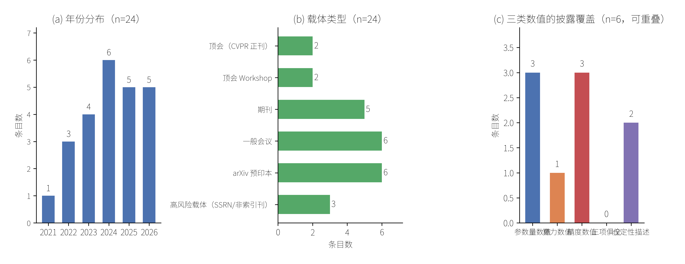

# 摘要

视觉 Transformer 以自注意力替代卷积，但二次复杂度与显存访问开销限制了其在移动端与
边缘设备上的部署。本文以满足严格计算预算的视觉 Transformer 方法为对象，对 2021–2026
年间经检索层获得的 24 条公开记录做文献层梳理，提出以**效率来源**为轴的四族分类
（注意力稀疏化、分组与级联、混合 CNN-Transformer、参数共享与模块重构），并给出可判定
样本的**证据强度分级**。分析显示：在 6 条带摘要记录中，给出参数量数值的 3 条、给出算力
数值的 1 条、给出精度数值的 3 条（三类字段可重叠），而**同时给出三项者为 0 条**；其余 18 条
仅具元数据而无摘要可供判定。这说明**跨论文性能比较在本证据基础上不成立**。本文贡献限于文献组织方式
与证据边界的显式化，不含任何新方法或新读数。

**关键词**：视觉 Transformer；计算效率；轻量化；证据边界；文献组织

# 1 引言

自注意力在视觉任务上的优势已被广泛接受，但其代价同样明确：注意力计算随 token 数呈
二次增长，且内存访问模式不友好。围绕"如何把成本压下来"，近五年出现了大量改进工作
（R01–R24）。

现有综述多**按任务分类**（分类、检测、分割、复原、视频），这种组织方式便于按应用检索，
却掩盖了一个更实质的差异：不同方法降低成本的**来源**并不相同。有的是把注意力范围
限制住（R02、R07），有的是改变通道组织以优化内存访问（R01），有的是让卷积承担局部
建模、注意力专注全局（R10、R13、R14），还有的是靠参数共享或模块重构直接压缩模型
（R03、R16、R17）。把"分类网络""检测网络"和"轻量网络"并列，读者难以判断某项改进到
底缓解了哪一类瓶颈。

本文因此改以**效率来源**为分类轴，并在同一批文献上额外记录**指标披露完备度**。后者
不是附带统计，而是理解该领域进展的前提：当多数工作不同时报告参数量、算力与精度时，
任何"谁更高效"的横向判断都缺乏共同基准。

# 2 方法与范围

**检索**：经学术检索层（CrossRef / arXiv）以"高效视觉 Transformer / 轻量化注意力"
为主题检索，返回 29 条记录，纳入 24 条。

**纳入口径**：记录含可核验 DOI 或 arXiv ID，且主题落在视觉 Transformer 的**计算效率**
改进上。剔除仅涉及 Transformer 一般应用而与效率无关者。**范围边界**：本批记录中
含 3D 点云（R02）、视频识别（R19、R20）与骨架动作识别（R21）各一支，本文将其一并
纳入"视觉"范畴，并在第 3 节对其是否适用于静态图像分类单独标注，不作默认推广。
**载体分级标准**：同行评审状态不可确认者（预印本平台，或未被主流索引收录且作者与出版
信息单薄的期刊）记为高风险载体；该标签为**判断**，不是对论文质量的裁决。本批按此标准
命中 R22、R23（SSRN 预印本）与 R24（未被主流索引收录的期刊）。

**研究模式**：本任务在 `materials_only` 模式下完成，即**仅使用已发表记录的表层信息**，
不进行任何实验、训练、评测或复现。这一限制直接决定了本文的证据上界：对未提供摘要的
18 条记录，其具体读数**不可知**。

**明确的证据边界**（本节的自我约束）：

1. 本文**未获取任何全文 PDF**，未经逐段核对；
2. 因此第 3 节的"四族分类"属**基于标题与摘要的初步归类**，是推断而非论文原文主张；
3. 本文**不进行任何跨论文数值比较**，理由见第 4 节。

# 3 方法族图谱

按效率来源划分，纳入文献可分为四族：

**F1 注意力稀疏化与结构化。** 通过限制每个查询可见的区域或引入可微锚点来削减注意力
计算量。代表：PatchFormer 以 patch attention 替代全局注意力（R02）；AnchorFormer 引入
可微锚点注意力（R07）。

**F2 分组与级联注意力。** 不减少注意力覆盖范围，而是重组通道与计算顺序以改善内存
访问效率。代表：EfficientViT 的级联分组注意力（R01）。这类工作提示：瓶颈未必是浮点
运算量本身，也可能是访存。

**F3 混合 CNN-Transformer。** 让卷积承担局部特征、注意力承担全局关系，从而在同等
预算下取得折中。代表：MobileNetv1-ViT 混合结构（R13）、LightFER（R14）、面向嵌入式
证件识别的超轻量卷积注意力网络（R10）、MCANet（R06）。

**F4 参数共享与模块重构。** 通过递归共享参数（R03）、统一的内在残差元模块（R16）或
直接设计亚百万参数档架构（R17）压缩规模。

此外还有两支不属于上述四族：以相对位置编码替代稠密算子（R20），以及冻结大型预训练
骨干、仅训练轻量头部（R19）。二者出现于视频识别与视觉-语言场景，是否适用于静态图像
分类尚不可从现有记录判断。

骨架动作识别一支（R21）以多分类器共识组织轻量系统，其效率来源与上述四族及两支均不可
直接对应，故本演练不为其指定族别，仅保留于纳入范围以备复核。

需要强调：**该分类是本文提出的组织方式**，而非对原文献主张的复述。

# 4 证据景观

图 1 由纳入的 24 条记录的真实元数据计算得到。

{#fig:evidence-landscape}

**图 1**　纳入文献的证据景观（n = 24）。(a) 年份分布；(b) 载体类型构成；(c) 6 条带摘要
记录中三类数值的披露覆盖（可重叠）。(a)(b) 两项计数可由 `reference_materials/source_index.md`
逐条回算（其中 sci-q1/q2/q3 合并计为期刊，conf 与 spie 合并计为一般会议）；
(c) 的逐条依据见 `evidence_bank.md` 的 E-A 台账。

三点观察：

**其一，方向活跃且产出分散。** 年份分布自 2021 年起持续，2024 年达到 6 条。载体构成
中，顶会正刊仅 2 条，Workshop 2 条、期刊 5 条、一般会议 6 条、arXiv 预印本 6 条，
另有 3 条属高风险载体（SSRN 预印本与非索引刊）。**这一构成意味着：若仅保留顶会正刊
与期刊（本批共 7 条），可用记录将缩减至不足三分之一。**

**其二，在有摘要子集内评测口径分裂，横向比较不成立。** 在 24 条记录中，可判定披露
情况的只有 6 条（其余 18 条检索层未返回摘要）：其中给出参数量数值的 3 条、给出算力
数值的 1 条、给出精度数值的 3 条，**同时给出三项者为 0 条**，另有 2 条未给任何数值。由于训练配方、数据划分与评测协议各不相同，**即使都给出 Top-1，
也不构成可比较的基准**。本文因此不做任何排序或"最优方法"判断。

**证据强度分级（本批，仅限 6 条带摘要记录）**：

| 级别 | 判据 | 条目 |
|---|---|---|
| 有数值可核 | 至少给出参数量、算力、精度中的一项数值 | R16、R17、R18、R20（4 条） |
| 仅定性描述 | 未给出任何数值 | R19、R21（2 条） |
| 披露状态不可知 | 检索层未返回摘要 | 其余 18 条 |

该分级只表示本批记录的**披露程度**，不表示方法优劣，也不跨条比较。

**其三，摘要体例系统性缺失负结果。** 在 6 条可读摘要中，**无一条**报告失败条件、
不适用场景或与基线的负面对照。这提示该体裁**可能**存在选择性报告倾向，但该迹象需
在全文层进一步检验；另需说明，本观察**仅覆盖 6 条**，不足以推广到全部 24 条。

# 5 讨论与局限

**可成立的四项文献层空白：**

- **GAP-1 评测口径不统一**：在 6 条带摘要记录中，给出参数量/算力/精度数值者各 3/1/3，
  **三项俱全 0 条**；其余 18 条披露状态不可知（第 4 节，限 6 条样本）。
- **GAP-2 负结果缺失**：6 条带摘要记录中未见失败条件报告（限 6 条样本）。
- **GAP-3 部署端真实延迟普遍未报告**：六条可读摘要均未给出延迟数值（依据：`evidence_bank.md`
  E-A 台账）。本条为**推断**，因全文未读；若全文实际给出延迟，该推断即被推翻。
- **GAP-4 高风险载体占比不低**：24 条中 3 条来自 SSRN 预印本平台或未被主流索引收录的
  期刊，同行评审状态不明。该标签为**判断**而非事实，判定依据与来源见第 2 节范围说明。

**不可成立、本文不主张的一项：**

- **GAP-5 效率与鲁棒性/分布外泛化的联合评估缺失**——该判断需要全文与实验证据，
  **超出本任务的证据范围**，故明确不写入结论。

**本文的五项局限：**

1. 未读全文，方法族归类停留在标题与摘要层；
2. 18 条记录无摘要，其读数与设置不可知；
3. 检索式为单一主题式，未做引文图扩展与滚雪球，存在漏检可能；
4. 样本量小（24 条），第 4 节的每一项观察都应视为初步的；
5. 引用标识的逐条核验未全部完成：6 条仅存 arXiv 标识、1 条 DOI 的标题匹配存疑，
   均未经逐条解析核验（详见 `citation_quality_audit.md`）。

# 6 结论

在纳入的 24 条公开记录上，视觉 Transformer 的效率化改进可按**效率来源**归为四族：
注意力稀疏化、分组与级联、混合 CNN-Transformer、参数共享与模块重构。在本批可判定记录（6 条带摘要）内，**评测口径分裂与负结果缺失**限制了跨工作比较的
可靠性（两项均为受限样本结论）。本文的贡献限于
这一组织方式与边界的显式化，不主张任何方法优劣，也不含新的实验读数。

# 参考文献

> 本表为**纳入语料全集**（24 条），其中 11 条未在正文单独引注，保留以备复核纳入口径。

[R01] Liu, X.; Peng, H.; Zheng, N.; Yang, Y.; Hu, H. et al. EfficientViT: Memory Efficient Vision Transformer with Cascaded Group Attention. *IEEE/CVF CVPR 2023*. 10.1109/cvpr52729.2023.01386
[R02] Zhang, C.; Wan, H.; Shen, X.; Wu, Z. PatchFormer: An Efficient Point Transformer with Patch Attention. *IEEE/CVF CVPR 2022*. 10.1109/cvpr52688.2022.01150
[R03] Liang, Y.; Anwar, S.; Liu, Y. DRT: A Lightweight Single Image Deraining Recursive Transformer. *IEEE/CVF CVPRW 2022*. 10.1109/cvprw56347.2022.00074
[R04] Choi, H.; Na, C.; Oh, J.; Lee, S.; Kim, J. et al. Reciprocal Attention Mixing Transformer for Lightweight Image Restoration. *IEEE/CVF CVPRW 2024*. 10.1109/cvprw63382.2024.00606
[R05] Li, G.; Zhao, T. Efficient image analysis with triple attention vision transformer. *Pattern Recognition*. 10.1016/j.patcog.2024.110357
[R06] Zhao, Z.; Hao, K.; Liu, X.; Zheng, T.; Xu, J. et al. MCANet: Hierarchical cross-fusion lightweight transformer based on multi-ConvHead attention for object detection. *Image and Vision Computing*. 10.1016/j.imavis.2023.104715
[R07] Shan, J.; Wang, J.; Zhao, L.; Cai, L.; Zhang, H. et al. AnchorFormer: Differentiable anchor attention for efficient vision transformer. *Pattern Recognition Letters*. 10.1016/j.patrec.2025.07.016
[R08] Chang, Z.; Cai, Q. Enhanced Vision Transformer with Dual-Dimensional Self-Attention for Image Recognition. *IEEE PRAI 2023*. 10.1109/prai59366.2023.10332027
[R09] Wu, Z.; Zhou, Y. ELiFormer: A hierarchical Transformer based Model with Efficient Encoder and Lightweight Decoder for Semantic Segmentation. *ACM ACCVIPR 2024*. 10.1145/3663976.3663985
[R10] Shen, Y.; Wei, J.; Niu, X.; Fu, G.; Cao, Z. Efficient ultra-lightweight convolutional attention network for embedded identity document recognition system. *Image and Vision Computing*. 10.1016/j.imavis.2026.105930
[R11] Garg, A.; Nigam, S.; Singh, R. Lightweight Vision Transformer with CBAM and LSTM for Efficient Violence Detection in Image Sequences. *Signal, Image and Video Processing*. 10.1007/s11760-026-05207-7
[R12] Slimani, N.; Jdey, I.; Kherallah, M. Improvement of Satellite Image Classification Using Attention-Based Vision Transformer. *ICAART 2024*. 10.5220/0012298400003636
[R13] Rani, M.; Kumar, M. Lightweight Hybrid MobileNetv1-Vision Transformer Model for Human Activity Recognition. *IEEE ICIIP 2025*. 10.1109/iciip68302.2025.11346208
[R14] Kaur, M.; Kumar, M. LightFER: A Lightweight Hybrid CNN-Transformer based Model for Efficient Facial Emotion Recognition. *IEEE ICIIP 2025*. 10.1109/iciip68302.2025.11346136
[R15] Li, Y.; Cai, B. EL Former-BEV: an efficient lightweight transformer-based BEV perception method. *SPIE CVIPPR 2025*. 10.1117/12.3076237
[R16] Zhang, J.; Hu, T.; He, H.; Xue, Z.; Wang, Y. et al. EMOv2: Pushing 5M Vision Model Frontier. *arXiv preprint 2412.06674*. arXiv:2412.06674
[R17] George, R.; Nishankar, S.; Thuseethan, S.; Ragel, R. G. UtVAA: Ultra-tiny Vision Transformer with Affix Attention for Mobile Image Classification. *arXiv preprint 2606.14735*. arXiv:2606.14735
[R18] Farooq, A.; Awais, M.; Ahmed, S.; Kittler, J. Global Interaction Modelling in Vision Transformer via Super Tokens. *arXiv preprint 2111.13156*. arXiv:2111.13156
[R19] Lin, Z.; Geng, S.; Zhang, R.; Gao, P.; de Melo, G. et al. Frozen CLIP Models are Efficient Video Learners. *arXiv preprint 2208.03550*. arXiv:2208.03550
[R20] Hao, Y.; Zhou, D.; Wang, Z.; Ngo, C.-W.; Wang, M. PosMLP-Video: Spatial and Temporal Relative Position Encoding for Efficient Video Recognition. *arXiv preprint 2407.02934*. arXiv:2407.02934
[R21] Oztimur Karadag, O. SkelVIT: Consensus of Vision Transformers for a Lightweight Skeleton-Based Action Recognition System. *arXiv preprint 2311.08094*. arXiv:2311.08094
[R22] Sanchez-Brito, M. DANTE: A Lightweight Hybrid CNN-Transformer Network for Efficient Image Classification. *SSRN preprint 2026*. 10.2139/ssrn.6811533
[R23] Zhu, Z.; Lu, S. Bc-Vit: Lightweight Transformer with Efficient Attention and Randomized Head for Blood Cells. *SSRN preprint 2025*. 10.2139/ssrn.5123368
[R24] Okafor, C. Lightweight Transformer-Fourier Fusion Framework for Efficient Image Super-Resolution. *International Bulletin of Applied Sciences and Technology 2026*. 10.37547/ibast/volume06issue08-02
